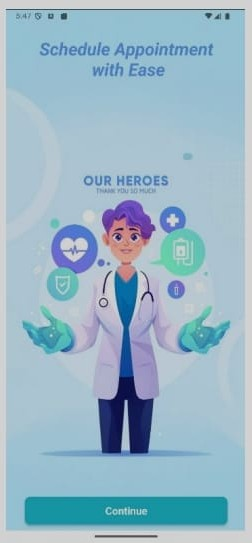
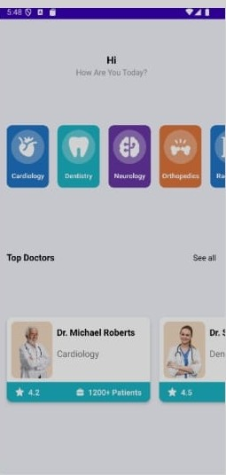
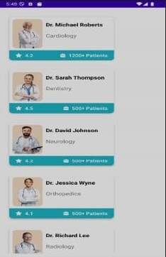
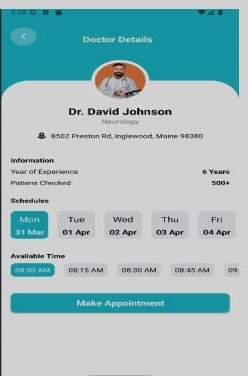
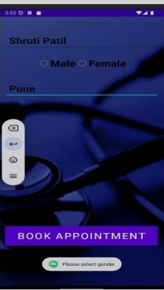

#  Doctor Appointment System (Prototype)

##  Overview

The Doctor Appointment System is an Android application designed to simplify the process of booking medical appointments. This prototype demonstrates how users can browse doctors and schedule appointments easily.

---

##  Features

*  Search doctors by specialty
*  Appointment booking interface
*  Time slot selection
*  Doctor listing UI
*  User login interface

---

##  Tech Stack

* Java
* XML
* Android Studio

---

##  Screenshots

---

##  Purpose

This project was developed to understand mobile application flow, UI/UX design, and healthcare-based system implementation.

---

##  Future Improvements

* Real-time database integration
* Online consultation feature
* Notifications & reminders

